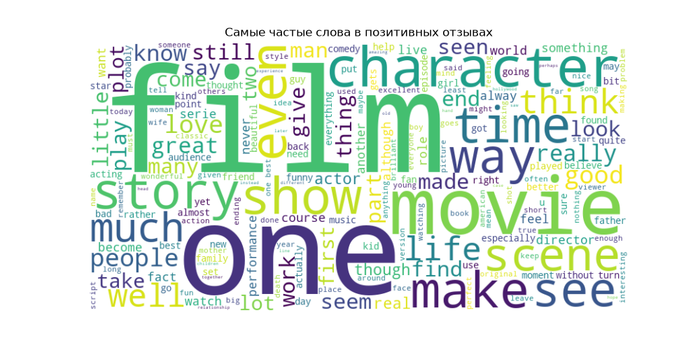
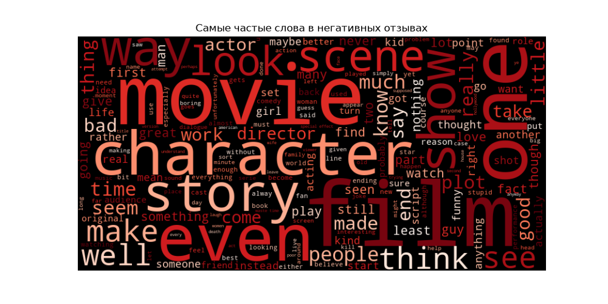

# Sentiment Analysis — IMDB Movie Reviews

NLP project that classifies movie reviews as positive or negative using machine learning.

## Demo

[Link to live app](paste your streamlit link here)

## Dataset

[IMDB Dataset of 50K Movie Reviews (Kaggle)](https://www.kaggle.com/datasets/lakshmi25npathi/imdb-dataset-of-50k-movie-reviews)
- 50,000 movie reviews
- Balanced: 25,000 positive / 25,000 negative

## How It Works

1. **Text Cleaning** — remove HTML tags, punctuation, stopwords, lowercase
2. **TF-IDF Vectorization** — convert text to numbers (10,000 features)
3. **Logistic Regression** — classify as positive or negative
4. **Result** — prediction with confidence percentage

## Results

| Metric | Score |
|--------|-------|
| Accuracy | 89.54% |
| Precision | 0.90 |
| Recall | 0.90 |
| F1-score | 0.90 |

## Visualizations

### Most frequent words — Positive reviews

### Most frequent words — Negative reviews

## Tech Stack

- Python, pandas — data processing
- NLTK — text preprocessing
- scikit-learn (TF-IDF + Logistic Regression) — ML model
- WordCloud, matplotlib — visualization
- Streamlit — web interface
- joblib — model saving

## How To Run

\`\`\`bash
pip install -r requirements.txt
python nlp.py        # train and save model
streamlit run app.py # launch web app
\`\`\`

## Note

This model works with English text only, as it was trained on English movie reviews.